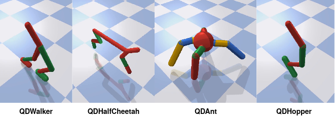
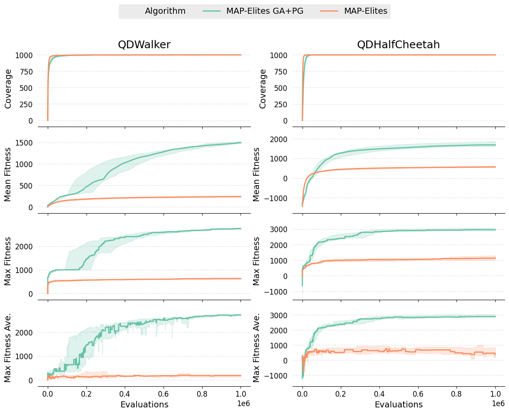
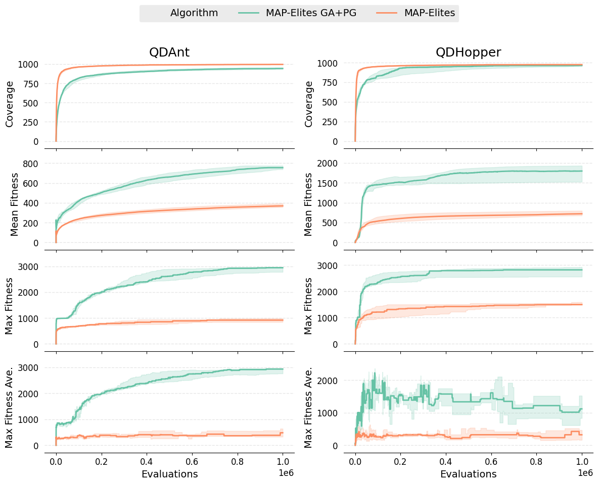
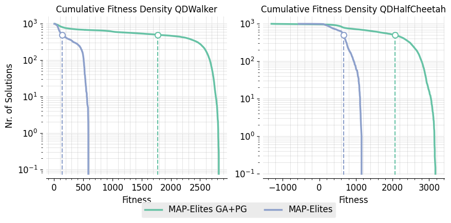
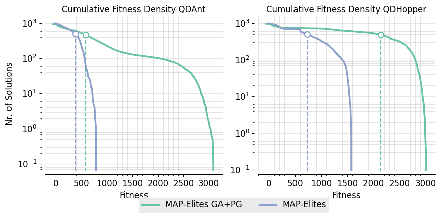

### Intro
MAP-Elites GAPG combines MAP-Elites and Actor-Critic DRL by training a critic network off-policy based on experience collected when perfoming evaluation of solutions.

This addresses some limitations of MAP-Elites by:

+ Incorporating gradient based search for increased search power.


+ Using an Action-Value function approximation that smooths the target policy and acts as an implicit averaging or smoothing of behaviours, leading to learning behaviours that don’t converge to narrow peaks in the fitness landscape and therefore are less sensitive to noise/stochasticity.


Based on original TD3 [paper](https://arxiv.org/pdf/1802.09477.pdf) and the CVT-MAP-Elites implemetation from [here](https://github.com/resibots/pymap_elites)


### Results

Evaluated on four stochastic tasks from [QDgym](https://github.com/ollenilsson19/QDgym) where the task is to discover ways to walk.

+ Behaviour: Feet contact time. 1000 niches. 
+ Fitness: Walking Distance
+ Controller: NN with ~ 20000 parameters.  


<p align="center">

</p>

The perfomance measure used are:

+ Coverage: The progression of the total number of solutions in the archive.  Coverage of 1000 is the maximum achievable in these tasks.

+ Mean Fitness: The progression of the mean of the fitness across all solutions in the archive.

+ Max Fitness: The progression of the overall highest fitness solution in the archive.


The bottom plots show the progression of the max fitness averaged over 10 evaluations. This is used as a statistic for assessing the robustness of the single evaluation used to add solutions to the archive. Only a sigle evaluation is used to add solutions to the archive in the algorithm.

Each experiment is repeated 10 times with different random seeds and the solid line displays the median and the shaded area is bounded by the first and third quartiles.

<p align="center">

</p>

<p align="center">

</p>

+ Typical progression of the archive for the QDWalker task:
<p align="center">

</p>

+ Typical progression of the archive for the QDCheetah task:

<p align="center">

</p>

+ Cumulative fitness density plots. These represent the likely number of solutions found in a fitness range for a given run of the algorithm. Calculated as the average over 10 seeds. The vertical line represents the median:

<p align="center">

</p>

<p align="center">

</p>


### How To Run the Code?

```shell script
git clone https://github.com/ollenilsson19/MAP-Elites-GAPG.git
cd MAP-Elites-GAPG/
```

#### Dependencies

MAP-Elites GAPG requires to install:

+ Python=3.6
+ torch
+ numpy
+ gym
+ pybullet
+ sklearn
+ [QDgym](https://github.com/ollenilsson19/QDgym)

these can be installed via the requirements file:
```shell script
pip3 install -r requirements.txt
```


#### Running

Withe the correct dependencies installed the code can be run by:

```shell script
python3 main.py
```
`main.py` takes a range of arguments which is easiest to pass as a .txt by using the `--config_file` argument:


```shell script
python3 main.py --config_file path/to/config_file/config_file.txt
```
A range of config files are included in the `configure_experiment` folder.

- local_config.txt
- QDHalfCheetah_config.txt
- QDWalker_config.txt
- QDAnt_config.txt
- QDHopper_config.txt


The QDHalfCheetah_config.txt, QDWalker_config.txt, QDAnt_config.txt, QDHopper_config.txt are the configs used to run the experiments that produced the results presented above. Although these configs are unlikely to run on your local computer as they are setup to run on resources avalable on a HPC system. The local_config.txt is setup to run the code locally for debugging/testing so I recommed you use the below for testing the code locally:

```shell script
python3 main.py --config_file configure_experiment/local_config.txt
```

The config file passed can be used to pass the following arguments:

Argument              |Comment
----------------------|----------
--config_file         |# Config file to load args (Typically you would only specifiy this arg)
--env       	        |# Environment name (only [QDgym](https://gitlab.doc.ic.ac.uk/AIRL/students_projects/2019-2020/olle_nilsson/QDgym) envs will run)
--seed              	|# Seed
--save_path 	        |# Path where to save results
--dim_map				      |# Dimentionality of behaviour space
--n_niches	          |# Nr. of niches/cells of behaviour
--n_species			      |# Nr. of species
--max_evals		        |# Nr. of evaluations 
--mutation_op				  |# Mutation operator to use
--crossover_op				|# Crossover operator to use (iso_dd uses mutation and crossover in one)
--min_genotype  	    |# Minimum value a gene in the genotype can take (if None no limit)
--max_genotype    	  |# Maximum value a gene in the genotype can take (if None no limit)
--mutation_rate       |# Probablity of a gene to be mutated
--crossover_rate      |# Probablity of genotypes being crossed over
--eta_m               |# Parameter for polynomaial mutation
--eta_c               |# Parameter for Simulated Binary Crossover
--sigma          	    |# Sandard deviation for gaussian muatation
--iso_sigma           |# Gaussian parameter in line mutation (iso_dd)
--line_sigma          |# Line parameter in line mutation (iso_dd)
--max_uniform         |# Max mutation for uniform muatation
--cvt_samples         |# Nr. of samples to use when approximating cetroid locations
--eval_batch_size	    |# Batch size for parallel evaluation of policies
--random_init			    |# Number of random evaluations to inililise 
--init_batch_size	    |# Batch size for parallel evaluation during random init
--save_period	        |# How many evaluations between saving archives
--num_cpu		          |# Nr. of CPUs to use in parallel evaluation
--num_cpu_var			    |# Nr. of CPUs to use in parallel variation
--use_cached_cvt	    |# Use cached centroids for BD if avalable?
--not_discard_dead	  |# Exlude to discard solutions that does not survive the entire simulation
--neurons_list	      |# List of neurons in actor network layers. Network will be of form [neurons_list + [action dim]]
--train_batch_size    |# Batch size for both actors and critic
--discount            |# Discount factor for critic
--tau                 |# Target networks update rate
--policy_noise        |# Noise added to target during critic update
--noise_clip          |# Range to clip target noise
--policy_freq         |# Frequency of delayed actor updates
--nr_of_steps_crit	  |# Nr of. training steps for global search
--nr_of_steps_act	    |# Nr of. training steps for local search
--proportion_evo	    |# Proportion of batch to use GA variation
--normalise				    |# Use layer norm
--affine			        |# Use affine transormation with layer norm
--gradient_op			    |# Use gradient baset variation
--lr			            |# Learning rate local search


If any argument is not specified in the config.txt file the default will be used. The default values of all arguments can be found by inspecting the `main.py` file.

If the CVT centroids that are requred by the specified configuration does not exist then it will be automatically generated before the algoritrhm is launced. A range of pre-computed CVTs are available in the `CVT` folder.

The best way to cenerate config files is to use the automated method implemeted in `generate_configs.py` file. This uses a base config file and generate configs by specifying the difference in argument values to achive the desired config. For example:

```python script
if __name__ == "__main__":
    base_config = "QDAnt_config.txt"

    variables_1 = ["env", "seed", "dim_map", "n_niches", "max_evals", "neurons_list"]
    ranges_1 = [["QDAntBulletEnv-v0"], range(10), [4], [1000], [1000000], ["128 128"]]
    param_grid_1 = generate_grid_configs(variables_1, ranges_1)

    variables_2 = ["env", "seed", "dim_map", "n_niches", "max_evals", "neurons_list"]
    ranges_2 = [["QDWalker2DBulletEnv-v0"], range(10), [2], [1000], [1000000], ["128 128"]]
    param_grid_2 = generate_grid_configs(variables_2, ranges_2)

    variables_3 = ["env", "seed", "dim_map", "n_niches", "max_evals", "neurons_list"]
    ranges_3 = [["QDHalfCheetahBulletEnv-v0"], range(10), [2], [1000], [1000000], ["128 128"]]
    param_grid_3 = generate_grid_configs(variables_3, ranges_3)

    variables_4 = ["env", "seed", "dim_map", "n_niches", "max_evals", "neurons_list"]
    ranges_4 = [["QDHopperBulletEnv-v0"], range(10), [1], [1000], [1000000], ["128 128"]]
    param_grid_4 = generate_grid_configs(variables_4, ranges_4)


    configs =  param_grid_1 + param_grid_2 + param_grid_3 + param_grid_4
    print(configs)
    print(len(configs))


    base = get_base_conf(base_config)
    for i, conf in enumerate(configs):
        name = f"config_{i+1 + 0}"
        write_conf_file(base, conf, name)
```

will generate config files enumerated from `config_1.txt` to `config_40.txt` using `QDAnt_config.txt` as a base when running:

```shell script
python3 generate_configs.py
```

#### Outputs

The output of the code will be saved in the location specified by the `--save_path` argument. The output is three main files. The progress file, the actors file and archive files. The log file takes is saved under `args.save_path/progress_{file_name}.dat` with `file_name = MAP-Elites-GAPG_{args.env}_{args.seed}_{args.dim_map}`. After each batch the progress file will log in each column:

- Nr of Evaluations
- Covarage 
- Max Fitness
- Mean Fitness
- Median Fitness
- 5th Precentile Fitness
- 95th Precentile Fitness
- Averaged Max Fitness (10 Evaluations)
- Averaged Max Fitness Behaviour Descriptor (10 Evaluations)

The actors file takes the form `args.save_path/actors_{file_name}.dat` and saves information about each actor added to the main archive.


- Nr of Evaluations
- id
- Fitness
- Behaviour Descriptor
- Associated CVT centroid
- Parent 1 id
- Parent 2 id
- type (evo/gradient)
- novel (bool)
- delta fitness (comapred to previous solution in that cell)

Each `--save_period` evaluations the state of the archive is saved under `args.save_path/archive_{file_name}_{nr_of_evaluations}.dat`. The saves info about each actor currently in the archive:


- Fitness
- Assosiated CVT centroid
- Behaviour Descriptor 
- id

The PyTorch network models are saved for all actors in the final archive under `args.save_path/models/{file_name}_actor_id`.


### References

```
@inproceedings{fujimoto2018addressing,
  title={Addressing Function Approximation Error in Actor-Critic Methods},
  author={Fujimoto, Scott and Hoof, Herke and Meger, David},
  booktitle={International Conference on Machine Learning},
  pages={1582--1591},
  year={2018}
}


@article{VassiliadesCM16,
  author    = {Vassilis Vassiliades and
               Konstantinos I. Chatzilygeroudis and
               Jean{-}Baptiste Mouret},
  title     = {Scaling Up MAP-Elites Using Centroidal Voronoi Tessellations},
  journal   = {CoRR},
  volume    = {abs/1610.05729},
  year      = {2016},
  url       = {http://arxiv.org/abs/1610.05729},
  archivePrefix = {arXiv},
  eprint    = {1610.05729},
  timestamp = {Mon, 13 Aug 2018 16:48:10 +0200},
  biburl    = {https://dblp.org/rec/journals/corr/VassiliadesCM16.bib},
  bibsource = {dblp computer science bibliography, https://dblp.org}
}

@article{Mouret2015,

archivePrefix = {arXiv},
arxivId = {1504.04909},
author = {Mouret, Jean-Baptiste and Clune, Jeff},
eprint = {1504.04909},
month = {apr},
title = {{Illuminating search spaces by mapping elites}},
url = {http://arxiv.org/abs/1504.04909},
year = {2015}
}

@article{vassiliades2018discovering,
title={Discovering the Elite Hypervolume by Leveraging Interspecies Correlation},
author={Vassiliades, Vassilis and Mouret, Jean-Baptiste},
journal={Proceedings of the Genetic and Evolutionary Computation Conference },
year={2018},
organization={ACM} }"
```
