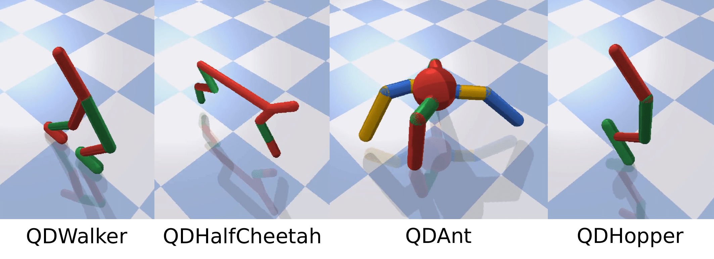
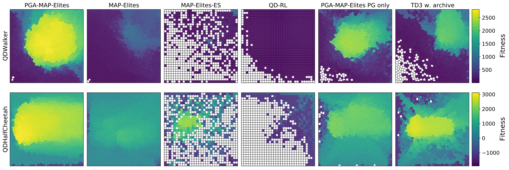
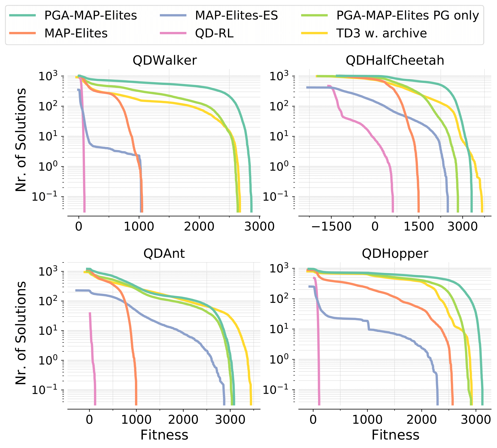

## Intro
This is the code for the PGA-MAP-Elites algorithm as submitted to GECCO '21. The paper can be found [here](https://github.com/ollenilsson19/PGA-MAP-Elites/tree/master/paper/PGA_MAP_Elites_GECCO.pdf).

PGA-MAP-Elites combines MAP-Elites and Actor-Critic DRL by training a critic network off-policy based on experience collected when evaluating solutions.

<p align="center">

</p>

This addresses some limitations of MAP-Elites by:

+ Incorporating gradient-based search for increased search power.


+ Using an Action-Value function approximation that smooths the target policy and acts as an implicit averaging or smoothing of behaviours, leading to learning behaviours that don’t converge to narrow peaks in the fitness landscape and therefore are less sensitive to noise/stochasticity.


Based on the TD3 [paper](https://arxiv.org/pdf/1802.09477.pdf) and the CVT-MAP-Elites implemetation from [here](https://github.com/resibots/pymap_elites)


Evaluated on four stochastic tasks from [QDgym](https://github.com/ollenilsson19/QDgym) where the task is to discover ways to walk.

+ Behaviour: Feet contact time.
+ Fitness: Walking Distance
+ Controller: NN with ~ 20000 parameters.  


<p align="center">

</p>


Here is a few examples of produced behaviours:

[](http://www.youtube.com/watch?v=-rvJrOa0scc "")


The performance measures used are:

+ QD-Score: The progression of the sum of fitness in the archive.

+ Coverage: The progression of the total number of solutions in the archive.  

+ Max Fitness: The progression of the overall highest fitness solution in the archive.


The bottom plots show the progression of the max fitness averaged over 10 evaluations. This is used as a statistic for assessing the robustness of the single evaluation used to add solutions to the archive. Only a single evaluation is used to add solutions to the archive in the algorithm.

Each experiment is repeated 20 times with different random seeds and the solid line displays the median and the shaded area is bounded by the first and third quartiles.

<p align="center">

</p>


+ Typical final archives for QDHalfCheetah and QDWalker:

<p align="center">

</p>


+ Cumulative fitness density plots. These represent the likely number of solutions found in a fitness range for a given run of the algorithm. Calculated as the average over 20 seeds:

<p align="center">

</p>


## How To Run the Code?

```shell script
git clone https://github.com/ollenilsson19/PGA-MAP-Elites.git
cd PGA-MAP-Elites/
```

PGA-MAP-Elites requires to install:

+ Python=3.6
+ torch==1.7.1
+ numpy==1.19.5
+ gym==0.15.4
+ pybullet==3.0.8
+ Cython==0.29.21
+ scikit-learn==0.21.3
+ [QDgym](https://github.com/ollenilsson19/QDgym)

these can be installed via the requirements file:
```shell script
pip3 install -r requirements.txt
```

If the installation fails, it will likely be due to your pip version being too old for the requirements of opencv (gym dependency). See https://pypi.org/project/opencv-python/. The solution is likely to upgrade pip.

```
pip install --upgrade pip
```

With the correct dependencies installed the code can be run by:

```shell script
python3 main.py
```
`main.py` takes a range of arguments which is easiest to pass as a .txt by using the `--config_file` argument:


```shell script
python3 main.py --config_file path/to/config_file/config_file.txt
```
A range of config files is included in the `configure_experiment` folder.

- local_config.txt
- QDHalfCheetah_config.txt
- QDWalker_config.txt
- QDAnt_config.txt
- QDHopper_config.txt


The QDHalfCheetah_config.txt, QDWalker_config.txt, QDAnt_config.txt, QDHopper_config.txt are the configs used to run the experiments that produced the results presented above and in the GECCO paper. Although these configs are unlikely to run on your local computer as they are setup to run on resources available on an HPC system. The local_config.txt is set up to run the code locally for debugging/testing so I recommend you use the below for testing the code locally:

```shell script
python3 main.py --config_file configure_experiment/local_config.txt
```

If you get "Too many open files" errors, this has to do with limitations imposed by your os and is not an error related to the code. Depending on your system, this may be solved by:

```shell script
ulimit -n 4000
```

The config file passed can be used to pass the following arguments:


Argument              |Comment
----------------------|----------
--config_file         |# Config file to load args (Typically you would only specify this arg)
--env                 |# Environment name (only [QDgym](https://github.com/ollenilsson19/QDgym) envs will run)
--seed                |# Seed
--save_path           |# Path where to save results
--dim_map             |# Dimentionality of behaviour space
--n_niches            |# Nr. of niches/cells of behaviour
--n_species           |# Nr. of species/cells in species archive (The species archive is disabled in the GECCO paper by setting n_species=1. See: ["What is the Species Archive?"](###what-is-the-species-archive?)
--max_evals           |# Nr. of evaluations (I)
--mutation_op         |# Mutation operator to use (Set to None in GECCO paper)
--crossover_op        |# Crossover operator to use (Set to iso_dd aka directional variation in GECCO paper which we implement as a mutation and crossover in one)
--min_genotype        |# Minimum value a gene in the genotype can take (if False no limit) (Set to False in GECCO paper)
--max_genotype        |# Maximum value a gene in the genotype can take (if False no limit) (Set to False in GECCO paper)
--mutation_rate       |# Probablity of a gene to be mutated (Not used in GECCO paper. iso_dd mutates all genes unconditionally)
--crossover_rate      |# Probablity of genotypes being crossed over (Not used in GECCO paper. iso_dd crosses all genes unconditionally)
--eta_m               |# Parameter for polynomial mutation (Not used in GECCO paper)
--eta_c               |# Parameter for Simulated Binary Crossover (Not used in GECCO paper)
--sigma               |# Sandard deviation for gaussian mutation (Not used in GECCO paper)
--iso_sigma           |# Gaussian parameter in iso_dd/directional variation (sigma_1)
--line_sigma          |# Line parameter in iso_dd/directional variation (sigma_2)
--max_uniform         |# Max mutation for uniform mutation (Not used in GECCO paper)
--cvt_samples         |# Nr. of samples to use when approximating archive cell-centroid locations
--eval_batch_size     |# Batch size for parallel evaluation of policies (b)
--random_init         |# Number of random evaluations to initialise (G)
--init_batch_size     |# Batch size for parallel evaluation during random init (b)
--save_period         |# How many evaluations between saving archives?
--num_cpu             |# Nr. of CPUs to use in parallel evaluation
--num_cpu_var         |# Nr. of CPUs to use in parallel variation
--use_cached_cvt      |# Use cached centroids for archive if available?
--not_discard_dead    |# Don't discard solutions that do not survive the entire simulation (Set to not discard in GECCO paper)
--neurons_list        |# List of neurons in actor-network layers. Network will be of form [neurons_list + [action dim]]
--train_batch_size    |# Batch size for both actors and critic (N)
--discount            |# Discount factor for critic (gamma)
--tau                 |# Target networks update rate (tau)
--policy_noise        |# Noise added to target during critic update (sigma_p)
--noise_clip          |# Range to clip target noise to (c)
--policy_freq         |# Frequency of delayed actor and target updates (d)
--nr_of_steps_crit    |# Nr of. training steps for critic training (n_crit)
--nr_of_steps_act     |# Nr of. training steps for PG variation (n_grad)
--proportion_evo      |# Proportion of batch to use GA variation (n_evo = proportion_evo * b. Set to 0.5 in GECCO paper)
--normalise           |# Use layer norm (Not used in GECCO paper)
--affine              |# Use affine transformation with layer norm (Not used in GECCO paper)
--gradient_op         |# Use PG variation 
--lr                  |# Learning rate PG variation


If any argument is not specified in the config.txt file the default will be used. The default values of all arguments can be found by inspecting the `main.py` file.

If the CVT centroids that are required by the specified configuration do not exist then they will be automatically generated before the algorithm is launched. A range of pre-computed CVTs is available in the `CVT` folder.

The best way to generate config files is to use the automated method implemented in the `generate_configs.py` file. This uses a base config file and generates configs by specifying the difference in argument values to achieve the desired config. For example:


```python script
if __name__ == "__main__":
    base_config = "QDAnt_config.txt"

    variables_1 = ["env", "seed", "dim_map", "n_niches", "max_evals", "neurons_list"]
    ranges_1 = [["QDAntBulletEnv-v0"], range(20), [4], [1296], [1000000], ["128 128"]]
    param_grid_1 = generate_grid_configs(variables_1, ranges_1)

    variables_2 = ["env", "seed", "dim_map", "n_niches", "max_evals", "neurons_list"]
    ranges_2 = [["QDWalker2DBulletEnv-v0"], range(20), [2], [1024], [1000000], ["128 128"]]
    param_grid_2 = generate_grid_configs(variables_2, ranges_2)

    variables_3 = ["env", "seed", "dim_map", "n_niches", "max_evals", "neurons_list"]
    ranges_3 = [["QDHalfCheetahBulletEnv-v0"], range(20), [2], [1024], [1000000], ["128 128"]]
    param_grid_3 = generate_grid_configs(variables_3, ranges_3)

    variables_4 = ["env", "seed", "dim_map", "n_niches", "max_evals", "neurons_list"]
    ranges_4 = [["QDHopperBulletEnv-v0"], range(20), [1], [1000], [1000000], ["128 128"]]
    param_grid_4 = generate_grid_configs(variables_4, ranges_4)


    configs =  param_grid_1 + param_grid_2 + param_grid_3 + param_grid_4
    print(configs)
    print(len(configs))


    base = get_base_conf(base_config)
    for i, conf in enumerate(configs):
        name = f"config_{i+1 + 0}"
        write_conf_file(base, conf, name)
```

will generate config files enumerated from `config_1.txt` to `config_80.txt` using `QDAnt_config.txt` as a base when running:

```shell script
python3 generate_configs.py
```

 The above snippet will generate configs to run each QDgym task for 20 seeds (exactly the configs used to get the results in the paper).


### Replicating the GECCO Paper Results

The different versions of the algorithm used in the paper can run be via the supplied singularity containers. To run these first install singularity (https://github.com/sylabs/singularity/blob/master/INSTALL.md).

To run a container do:

```shell script
./container_name.sif
```

When the container executes the config to run is decided by the value of the environment variable `$PBS_ARRAY_INDEX` such that the config file passed will be `configure_experiment/config_$PBS_ARRAY_INDEX.txt`. The config to run inside the container can thus be set by:

```shell script
export PBS_ARRAY_INDEX some_integer
```
To replicate the results from the paper run the following containers and configs:

- **PGA-MAP-Elites**: [PGA-MAP-Elites.sif](https://drive.google.com/file/d/1CSR00JVxpDhszh2rnwwO2E2ztWCBtEKe/view?usp=sharing) `config_1.txt` - `config_80.txt`
- **PGA-MAP-Elites PG only version**: [PGA-MAP-Elites.sif](https://drive.google.com/file/d/1CSR00JVxpDhszh2rnwwO2E2ztWCBtEKe/view?usp=sharing) `config_81.txt` - `config_160.txt`
- **MAP-Elites**: [MAP-Elites.sif](https://drive.google.com/file/d/1E2mRRmq_rLSX7CbtYMDQ2bkQ7RWgGEct/view?usp=sharing) `config_1.txt` - `config_80.txt`
- **TD3 w. Archive**: [TD3-MAP-Elites-Archive.sif](https://drive.google.com/file/d/1DaTDYouIA2F5aQ5C-oBdaj4pB7SACDrv/view?usp=sharing) `config_1.txt` - `config_80.txt`
- **MAP-Elites-ES**:[MAP-Elites-ES.sif](https://drive.google.com/file/d/1EzoKNpQC8MpBvG7d-7IgkHh-zn8KsRaj/view?usp=sharing) `config_1.txt` - `config_80.txt`

The QD-RL container will not be made public as the authors of QD-RL are yet to officially release their code.


### Settings for Running PGA-MAP-Elites

We recommend using the following setting for the code to run optimally:

```shell script
KMP_SETTING="KMP_AFFINITY=granularity=fine,compact,1,0"
KMP_BLOCKTIME=1

export $KMP_SETTING
export KMP_BLOCKTIME=$KMP_BLOCKTIME
export OMP_NUM_THREADS=1
export MKL_NUM_THREADS=1
```

### Description of Outputs

The output of the code will be saved in the location specified by the `--save_path` argument. The output is three main files. The progress file, the actors file, and archive files. The log file is saved under `args.save_path/progress_{file_name}.dat` with `file_name = PGA-MAP-Elites_{args.env}_{args.seed}_{args.dim_map}`. After each batch the progress file will log in each column:

- Nr of Evaluations
- Coverage 
- Max Fitness
- Mean Fitness
- Median Fitness
- 5th Percentile Fitness
- 95th Percentile Fitness
- Averaged Max Fitness (10 Evaluations)
- Averaged Max Fitness Behaviour Descriptor (10 Evaluations)

The actors file takes the form `args.save_path/actors_{file_name}.dat` and saves information about each actor added to the main archive.


- Nr of Evaluations
- id
- Fitness
- Behaviour Descriptor
- Associated CVT centroid
- Parent 1 id
- Parent 2 id
- type (evo/gradient)
- novel (bool)
- delta fitness (compared to the previous solution in that cell)

Each `--save_period` evaluations the state of the archive is saved under `args.save_path/archive_{file_name}_{nr_of_evaluations}.dat`. The saves info about each actor currently in the archive:


- Fitness
- Assosiated CVT centroid
- Behaviour Descriptor 
- id

The PyTorch network models are saved for all actors in the final archive under `args.save_path/models/{file_name}_actor_id`.

### What is the Species Archive?

In the code there are is a secondary archive called the "species archive" and a parameter `--n_species`, neither of which are mentioned in the GECCO paper. What do these terms mean? 

The species archive is a remnant from earlier versions of PGA-MAP-Elites where a slightly different method for training the critic was used. In this method, we used an additional MAP-Elites archive called the "species archive" to form a pool of diverse controllers for use in the critic training. This archive had a coarse discretization (typically 10 or fewer cells) where each cell represented a "species". The parameter `--n_species` sets the number of cells in the species archive. The first solution found belonging to each species would be added to the archive and in the critic training, the action with the maximum action-value across all controllers in the species archive selected. The idea behind this method is that using controllers originating in different regions of the behavioural space would create better estimates for the best subsequent action in the critic training. 

We found that the species archive method only had negligible benefits for the behavioural repertoire-building tasks in the paper and thus did not warrant the increased complexity of the algorithm. We still elected to keep the species archive in the code as it may be more beneficial in other tasks but effectively disabled it by setting `--n_species=1`. By doing this the critic training method becomes the "greedy controller" method described in the GECCO paper.

### Relevant Bibtexes

```
@inproceedings{nilsson2021_PGA-MAP-Elites,
  TITLE = {{Policy Gradient Assisted MAP-Elites}},
  AUTHOR = {Nilsson, Olle and Cully, Antoine},
  URL = {https://hal.archives-ouvertes.fr/hal-03135723},
  BOOKTITLE = {{The Genetic and Evolutionary Computation Conference}},
  ADDRESS = {Lille, France},
  YEAR = {2021},
  MONTH = Jul,
  DOI = {10.1145/3449639.3459304},
  PDF = {https://hal.archives-ouvertes.fr/hal-03135723v2/file/PGA_MAP_Elites_GECCO.pdf},
  HAL_ID = {hal-03135723},
  HAL_VERSION = {v2},
}

@inproceedings{fujimoto2018addressing,
  title={Addressing Function Approximation Error in Actor-Critic Methods},
  author={Fujimoto, Scott and Hoof, Herke and Meger, David},
  booktitle={International Conference on Machine Learning},
  pages={1582--1591},
  year={2018}
}


@article{VassiliadesCM16,
  author    = {Vassilis Vassiliades and
               Konstantinos I. Chatzilygeroudis and
               Jean{-}Baptiste Mouret},
  title     = {Scaling Up MAP-Elites Using Centroidal Voronoi Tessellations},
  journal   = {CoRR},
  volume    = {abs/1610.05729},
  year      = {2016},
  url       = {http://arxiv.org/abs/1610.05729},
  archivePrefix = {arXiv},
  eprint    = {1610.05729},
  timestamp = {Mon, 13 Aug 2018 16:48:10 +0200},
  biburl    = {https://dblp.org/rec/journals/corr/VassiliadesCM16.bib},
  bibsource = {dblp computer science bibliography, https://dblp.org}
}

@article{Mouret2015,

archivePrefix = {arXiv},
arxivId = {1504.04909},
author = {Mouret, Jean-Baptiste and Clune, Jeff},
eprint = {1504.04909},
month = {apr},
title = {{Illuminating search spaces by mapping elites}},
url = {http://arxiv.org/abs/1504.04909},
year = {2015}
}

@article{vassiliades2018discovering,
title={Discovering the Elite Hypervolume by Leveraging Interspecies Correlation},
author={Vassiliades, Vassilis and Mouret, Jean-Baptiste},
journal={Proceedings of the Genetic and Evolutionary Computation Conference },
year={2018},
organization={ACM} }"
```
